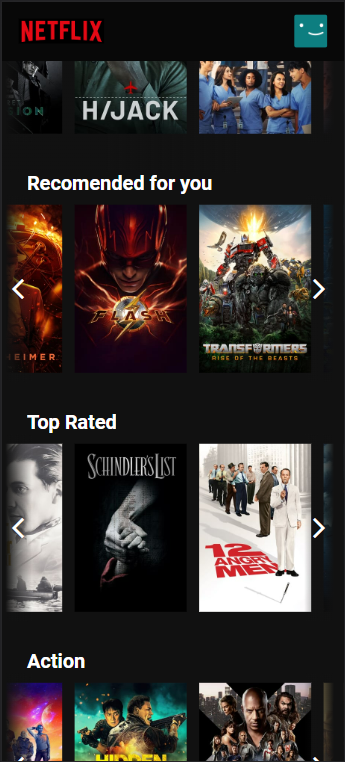

# NETFLIX - clone

<!--  -->


This application is a clone of the Netflix homepage. It features a recommended show or film as the cover, along with its synopsis. Additionally, similar to the original site, there are buttons to add the media to the user's playlist and to watch it, although these buttons are not functional at the moment.

The app includes lists of films and shows, separated by their genres, and users can easily navigate through them using the navigation arrows. All the information for these media items is acquired using the TMDB API.

Moreover, this app is fully responsive, ensuring compatibility with different screen sizes.

## Index
- <a href="#functionalities">Application functionalities</a>
- <a href="#layout">Layout</a>
- <a href="#demonstration">Demonstration</a>
- <a href="#run">How to run the application</a>
- <a href="#tecnologies-used">Tecnologies used</a>
- <a href="#developer">Developer</a>
- <a href="#next-steps">Next steps</a>

## Application functionalities
 - [x]  Navigation through films/shows lists  
 - [x]  Visible synopsis for the featured cover media
 - [x]  Compatibility with different screen sizes

## Layout
1. Desktop


2. Mobile





## Demonstration

[Link (deploy)](https://aback-knot.surge.sh/)

1. Desktop

https://github.com/Julia-slvbrg/netflix-clone/assets/114543081/69185850-6cef-480c-b13b-672d39036bec

2.Mobile

https://github.com/Julia-slvbrg/netflix-clone/assets/114543081/f1f8955e-0b6b-4af5-a471-ddc7fe711609


## How to run the application
```bash
# Clone this repository
$ git clone repolink

# Acess the app folder on your terminal
$ cd netflix-clone

# Install the dependencies
$ npm install

# Run the app 
$ npm run dev

# Acesse a apicação pelo navegador:
http://127.0.0.1:5173/
```

## Tecnologies used
1. [React JS](https://react.dev/)
2. [Vite](https://vitejs.dev/)
3. Styled-components
4. React Router
5. React Context
6. React Hooks
7. [TMDB API](https://developer.themoviedb.org/docs)
8. Media Query

## Developer
[LinkedIn](https://www.linkedin.com/in/julia-silva-borges/)

## Next steps
 - [ ] Add a page for each film/show to view more info about it.
 - [ ] Implement a function to add films/shows to the users list.
  - [ ] Implement a "My list" row.
  - [ ] Implement a function to watch the film/show trailer.
  
